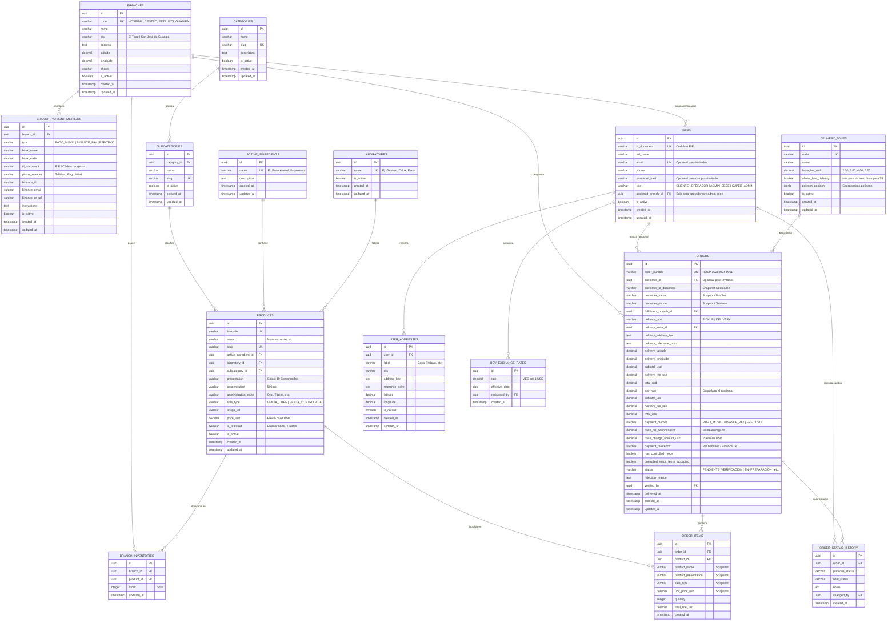

# DATA_MODEL.md - Modelo Físico y Relacional de Datos

Este documento define de forma exhaustiva el esquema relacional para **HospisaludWeb** en **PostgreSQL**, gestionado mediante **TypeORM** con migraciones formales versionadas (`synchronize: false`).

---

## 1. Diagrama Entidad-Relación (Mermaid)

---

## 2. Detalle de Tablas y Atributos

### 2.1 Módulo Sucursales (`branches`)

#### Tabla: `branches`
Define las 4 sedes físicas de la red farmacéutica.

| Columna | Tipo PostgreSQL | Restricciones | Descripción |
| :--- | :--- | :--- | :--- |
| `id` | `UUID` | `PRIMARY KEY, DEFAULT gen_random_uuid()` | Identificador universal único. |
| `code` | `VARCHAR(20)` | `NOT NULL, UNIQUE` | Código clave: `HOSPITAL`, `CENTRO`, `PETRUCCI`, `GUANIPA`. |
| `name` | `VARCHAR(100)` | `NOT NULL` | Nombre descriptivo de la sede física. |
| `city` | `VARCHAR(50)` | `NOT NULL` | Ciudad (`El Tigre` o `San José de Guanipa`). |
| `address` | `TEXT` | `NOT NULL` | Dirección física detallada. |
| `latitude` | `DECIMAL(10, 8)` | `NOT NULL` | Latitud GPS para cálculo de distancias. |
| `longitude` | `DECIMAL(11, 8)` | `NOT NULL` | Longitud GPS para cálculo de distancias. |
| `phone` | `VARCHAR(30)` | `NOT NULL` | Teléfono de contacto de la sede. |
| `is_active` | `BOOLEAN` | `NOT NULL, DEFAULT true` | Estado operativo de la sucursal. |
| `created_at` | `TIMESTAMPTZ` | `NOT NULL, DEFAULT NOW()` | Fecha y hora de creación. |
| `updated_at` | `TIMESTAMPTZ` | `NOT NULL, DEFAULT NOW()` | Fecha y hora de última actualización. |

*Índices:*
* `idx_branches_code` ON `code`.
* `idx_branches_city` ON `city`.

---

#### Tabla: `branch_payment_methods`
Cuentas bancarias y medios de pago independientes por cada sede física.

| Columna | Tipo PostgreSQL | Restricciones | Descripción |
| :--- | :--- | :--- | :--- |
| `id` | `UUID` | `PRIMARY KEY, DEFAULT gen_random_uuid()` | Identificador único. |
| `branch_id` | `UUID` | `NOT NULL, REFERENCES branches(id) ON DELETE CASCADE` | Sede a la que pertenecen los datos de pago. |
| `type` | `VARCHAR(30)` | `NOT NULL` | `PAGO_MOVIL`, `BINANCE_PAY`, `EFECTIVO`. |
| `bank_name` | `VARCHAR(50)` | `NULLABLE` | Nombre de la entidad bancaria (ej. Banesco, Mercantil, BDV). |
| `bank_code` | `VARCHAR(10)` | `NULLABLE` | Código bancario emisor (ej. 0134, 0105, 0102). |
| `id_document` | `VARCHAR(20)` | `NULLABLE` | Cédula o RIF receptor asociado al Pago Móvil. |
| `phone_number` | `VARCHAR(30)` | `NULLABLE` | Número telefónico receptor de Pago Móvil. |
| `binance_id` | `VARCHAR(50)` | `NULLABLE` | Pay ID de Binance de la sede. |
| `binance_email` | `VARCHAR(100)` | `NULLABLE` | Correo de cuenta Binance Pay. |
| `binance_qr_url` | `VARCHAR(500)` | `NULLABLE` | URL de la imagen del código QR de Binance. |
| `instructions` | `TEXT` | `NULLABLE` | Indicaciones especiales para el cliente al momento de pagar. |
| `is_active` | `BOOLEAN` | `NOT NULL, DEFAULT true` | Estado de disponibilidad del método en la sede. |
| `created_at` | `TIMESTAMPTZ` | `NOT NULL, DEFAULT NOW()` | Fecha de registro. |
| `updated_at` | `TIMESTAMPTZ` | `NOT NULL, DEFAULT NOW()` | Última actualización. |

*Índices:*
* `idx_branch_pm_branch_type` ON `(branch_id, type)`.

---

### 2.2 Módulo Catálogo e Inventario (`catalog`)

#### Tabla: `categories`
| Columna | Tipo PostgreSQL | Restricciones | Descripción |
| :--- | :--- | :--- | :--- |
| `id` | `UUID` | `PRIMARY KEY, DEFAULT gen_random_uuid()` | Identificador único. |
| `name` | `VARCHAR(100)` | `NOT NULL` | Nombre (ej. *Medicamentos*, *Cuidado Personal*, *Bebés*). |
| `slug` | `VARCHAR(100)` | `NOT NULL, UNIQUE` | Identificador URL-friendly. |
| `description` | `TEXT` | `NULLABLE` | Descripción general. |
| `is_active` | `BOOLEAN` | `NOT NULL, DEFAULT true` | Estado activo. |
| `created_at` | `TIMESTAMPTZ` | `NOT NULL, DEFAULT NOW()` | Fecha de creación. |
| `updated_at` | `TIMESTAMPTZ` | `NOT NULL, DEFAULT NOW()` | Última actualización. |

---

#### Tabla: `subcategories`
| Columna | Tipo PostgreSQL | Restricciones | Descripción |
| :--- | :--- | :--- | :--- |
| `id` | `UUID` | `PRIMARY KEY, DEFAULT gen_random_uuid()` | Identificador único. |
| `category_id` | `UUID` | `NOT NULL, REFERENCES categories(id) ON DELETE RESTRICT` | Categoría principal padre. |
| `name` | `VARCHAR(100)` | `NOT NULL` | Nombre (ej. *Analgésicos*, *Antibióticos*, *Vitaminas*). |
| `slug` | `VARCHAR(100)` | `NOT NULL, UNIQUE` | Identificador URL-friendly. |
| `is_active` | `BOOLEAN` | `NOT NULL, DEFAULT true` | Estado activo. |
| `created_at` | `TIMESTAMPTZ` | `NOT NULL, DEFAULT NOW()` | Fecha de creación. |
| `updated_at` | `TIMESTAMPTZ` | `NOT NULL, DEFAULT NOW()` | Última actualización. |

*Índices:*
* `idx_subcategories_category_id` ON `category_id`.

---

#### Tabla: `active_ingredients` (Principios Activos)
Fundamental para el algoritmo de sugerencia de productos sustitutos/equivalentes.

| Columna | Tipo PostgreSQL | Restricciones | Descripción |
| :--- | :--- | :--- | :--- |
| `id` | `UUID` | `PRIMARY KEY, DEFAULT gen_random_uuid()` | Identificador único. |
| `name` | `VARCHAR(150)` | `NOT NULL, UNIQUE` | Nombre del compuesto (ej. *Paracetamol*, *Ibuprofeno*, *Alprazolam*). |
| `description` | `TEXT` | `NULLABLE` | Descripción farmacológica complementaria. |
| `created_at` | `TIMESTAMPTZ` | `NOT NULL, DEFAULT NOW()` | Fecha de creación. |
| `updated_at` | `TIMESTAMPTZ` | `NOT NULL, DEFAULT NOW()` | Última modificación. |

*Índices:*
* `idx_active_ingredients_name` ON `name`.

---

#### Tabla: `laboratories` (Laboratorios y Marcas)
| Columna | Tipo PostgreSQL | Restricciones | Descripción |
| :--- | :--- | :--- | :--- |
| `id` | `UUID` | `PRIMARY KEY, DEFAULT gen_random_uuid()` | Identificador único. |
| `name` | `VARCHAR(150)` | `NOT NULL, UNIQUE` | Nombre (ej. *Genven*, *Calox*, *Elmor*, *Bayer*, *Pfizer*). |
| `is_active` | `BOOLEAN` | `NOT NULL, DEFAULT true` | Estado activo. |
| `created_at` | `TIMESTAMPTZ` | `NOT NULL, DEFAULT NOW()` | Fecha de creación. |
| `updated_at` | `TIMESTAMPTZ` | `NOT NULL, DEFAULT NOW()` | Última modificación. |

---

#### Tabla: `products`
Catálogo unificado de productos farmacéuticos.

| Columna | Tipo PostgreSQL | Restricciones | Descripción |
| :--- | :--- | :--- | :--- |
| `id` | `UUID` | `PRIMARY KEY, DEFAULT gen_random_uuid()` | Identificador único. |
| `barcode` | `VARCHAR(50)` | `NOT NULL, UNIQUE` | Código de barras estándar (EAN-13, UPC). |
| `name` | `VARCHAR(200)` | `NOT NULL` | Nombre comercial de venta. |
| `slug` | `VARCHAR(220)` | `NOT NULL, UNIQUE` | Slug para rutas de producto. |
| `active_ingredient_id` | `UUID` | `NOT NULL, REFERENCES active_ingredients(id) ON DELETE RESTRICT` | Principio activo asociado. |
| `laboratory_id` | `UUID` | `NOT NULL, REFERENCES laboratories(id) ON DELETE RESTRICT` | Laboratorio fabricante o marca comercial. |
| `subcategory_id` | `UUID` | `NOT NULL, REFERENCES subcategories(id) ON DELETE RESTRICT` | Subcategoría clasificatoria. |
| `presentation` | `VARCHAR(100)` | `NOT NULL` | Presentación comercial (ej. *Caja x 10 Tabletas*, *Frasco 120ml*). |
| `concentration` | `VARCHAR(50)` | `NOT NULL` | Concentración química (ej. *500mg*, *10mg/5ml*). |
| `administration_route`| `VARCHAR(50)` | `NOT NULL` | Vía (ej. *Oral*, *Tópica*, *Oftálmica*, *Intravenosa*). |
| `sale_type` | `VARCHAR(20)` | `NOT NULL, CHECK (sale_type IN ('VENTA_LIBRE', 'VENTA_CONTROLADA'))` | Régimen regulatorio de venta. |
| `image_url` | `VARCHAR(500)` | `NULLABLE` | URL pública de la imagen del producto (almacenada en Azure Blob / Azurite). |
| `price_usd` | `DECIMAL(10, 2)` | `NOT NULL, CHECK (price_usd >= 0)` | Precio unitario base en dólares estadounidenses. |
| `is_featured` | `BOOLEAN` | `NOT NULL, DEFAULT false` | Destacado en promociones u ofertas especiales. |
| `is_active` | `BOOLEAN` | `NOT NULL, DEFAULT true` | Visibilidad en catálogo web. |
| `created_at` | `TIMESTAMPTZ` | `NOT NULL, DEFAULT NOW()` | Fecha de registro. |
| `updated_at` | `TIMESTAMPTZ` | `NOT NULL, DEFAULT NOW()` | Última actualización de metadatos o precio. |

*Índices:*
* `idx_products_barcode` ON `barcode`.
* `idx_products_name_trgm` (GIST / GIN para búsqueda predictiva).
* `idx_products_active_ingredient` ON `active_ingredient_id`.
* `idx_products_subcategory` ON `subcategory_id`.
* `idx_products_sale_type` ON `sale_type`.

---

#### Tabla: `branch_inventories`
Existencias numéricas de productos independientes por cada una de las 4 sedes.

| Columna | Tipo PostgreSQL | Restricciones | Descripción |
| :--- | :--- | :--- | :--- |
| `id` | `UUID` | `PRIMARY KEY, DEFAULT gen_random_uuid()` | Identificador único de fila de inventario. |
| `branch_id` | `UUID` | `NOT NULL, REFERENCES branches(id) ON DELETE CASCADE` | Sede física propietaria del stock. |
| `product_id` | `UUID` | `NOT NULL, REFERENCES products(id) ON DELETE CASCADE` | Producto inventariado. |
| `stock` | `INTEGER` | `NOT NULL, CHECK (stock >= 0), DEFAULT 0` | Cantidad física disponible. |
| `updated_at` | `TIMESTAMPTZ` | `NOT NULL, DEFAULT NOW()` | Momento del último ajuste o descuento. |

*Restricciones e Índices:*
* `UNIQUE(branch_id, product_id)`: Un producto solo tiene un registro de inventario por sede.
* `idx_branch_inventories_search` ON `(branch_id, product_id, stock)`.

---

### 2.3 Módulo Moneda y Tasa BCV (`currency`)

#### Tabla: `bcv_exchange_rates`
Historial de tasas de cambio oficiales del Banco Central de Venezuela.

| Columna | Tipo PostgreSQL | Restricciones | Descripción |
| :--- | :--- | :--- | :--- |
| `id` | `UUID` | `PRIMARY KEY, DEFAULT gen_random_uuid()` | Identificador de registro de tasa. |
| `rate` | `DECIMAL(12, 4)` | `NOT NULL, CHECK (rate > 0)` | Tasa oficial expresada en Bolívares (VES) por 1 USD. |
| `effective_date` | `DATE` | `NOT NULL` | Fecha de vigencia de la tasa oficial. |
| `registered_by` | `UUID` | `NULLABLE, REFERENCES users(id) ON DELETE SET NULL` | Super Administrador que cargó o confirmó la tasa diaria. |
| `created_at` | `TIMESTAMPTZ` | `NOT NULL, DEFAULT NOW()` | Momento de registro en el sistema. |

*Índices:*
* `idx_bcv_rates_effective_date` ON `effective_date DESC`.

---

### 2.4 Módulo Autenticación y Usuarios (`auth`)

#### Tabla: `users`
Cuentas de clientes registrados y personal administrativo de la empresa.

| Columna | Tipo PostgreSQL | Restricciones | Descripción |
| :--- | :--- | :--- | :--- |
| `id` | `UUID` | `PRIMARY KEY, DEFAULT gen_random_uuid()` | Identificador único de usuario. |
| `id_document` | `VARCHAR(20)` | `NOT NULL, UNIQUE` | Cédula de Identidad o RIF venezolano (ej. `V-12345678`). |
| `full_name` | `VARCHAR(150)` | `NOT NULL` | Nombre y apellido del usuario o cliente. |
| `email` | `VARCHAR(150)` | `NULLABLE, UNIQUE` | Correo electrónico (opcional para compras en modo invitado). |
| `phone` | `VARCHAR(30)` | `NOT NULL` | Teléfono móvil de contacto. |
| `password_hash` | `VARCHAR(255)` | `NULLABLE` | Hash bcrypt (nulo para registros generados como invitado). |
| `role` | `VARCHAR(20)` | `NOT NULL, CHECK (role IN ('CLIENTE', 'OPERADOR', 'ADMIN_SEDE', 'SUPER_ADMIN'))` | Rol en el sistema. |
| `assigned_branch_id`| `UUID` | `NULLABLE, REFERENCES branches(id) ON DELETE SET NULL` | Sede asignada (obligatorio para `OPERADOR` y `ADMIN_SEDE`). |
| `is_active` | `BOOLEAN` | `NOT NULL, DEFAULT true` | Estado de habilitación de la cuenta. |
| `created_at` | `TIMESTAMPTZ` | `NOT NULL, DEFAULT NOW()` | Fecha de registro. |
| `updated_at` | `TIMESTAMPTZ` | `NOT NULL, DEFAULT NOW()` | Última actualización. |

*Índices:*
* `idx_users_id_document` ON `id_document`.
* `idx_users_email` ON `email`.
* `idx_users_role_branch` ON `(role, assigned_branch_id)`.

---

#### Tabla: `user_addresses`
Libreta de direcciones guardadas para clientes registrados.

| Columna | Tipo PostgreSQL | Restricciones | Descripción |
| :--- | :--- | :--- | :--- |
| `id` | `UUID` | `PRIMARY KEY, DEFAULT gen_random_uuid()` | Identificador de dirección. |
| `user_id` | `UUID` | `NOT NULL, REFERENCES users(id) ON DELETE CASCADE` | Cliente propietario. |
| `label` | `VARCHAR(50)` | `NOT NULL` | Etiqueta personalizada (*Casa*, *Trabajo*, *Casa Mamá*). |
| `city` | `VARCHAR(50)` | `NOT NULL` | Ciudad (`El Tigre`, `San José de Guanipa`, `San Tomé`). |
| `address_line` | `TEXT` | `NOT NULL` | Sector, calle, número de casa/edificio. |
| `reference_point` | `TEXT` | `NULLABLE` | Punto de referencia visual. |
| `latitude` | `DECIMAL(10, 8)` | `NOT NULL` | Latitud fijada con el pin en Google Maps. |
| `longitude` | `DECIMAL(11, 8)` | `NOT NULL` | Longitud fijada con el pin en Google Maps. |
| `is_default` | `BOOLEAN` | `NOT NULL, DEFAULT false` | Indica si es la dirección predeterminada. |
| `created_at` | `TIMESTAMPTZ` | `NOT NULL, DEFAULT NOW()` | Fecha de guardado. |
| `updated_at` | `TIMESTAMPTZ` | `NOT NULL, DEFAULT NOW()` | Última modificación. |

---

### 2.5 Módulo Órdenes y Logística de Despacho (`orders`)

#### Tabla: `delivery_zones`
Configuración de zonas poligonales y tarifas base para delivery.

| Columna | Tipo PostgreSQL | Restricciones | Descripción |
| :--- | :--- | :--- | :--- |
| `id` | `UUID` | `PRIMARY KEY, DEFAULT gen_random_uuid()` | Identificador único de zona. |
| `code` | `VARCHAR(30)` | `NOT NULL, UNIQUE` | Código (ej. `TIGRE_URBANA`, `TIGRE_INTERMEDIA`, `TIGRE_RETIRADA`, `GUANIPA_LOCAL`, `SAN_TOME`, `CROSS_CITY`). |
| `name` | `VARCHAR(100)` | `NOT NULL` | Nombre descriptivo de la zona. |
| `base_fee_usd` | `DECIMAL(6, 2)` | `NOT NULL, CHECK (base_fee_usd >= 0)` | Tarifa base ($2.00, $3.00, $4.00 o $5.00 USD). |
| `allows_free_delivery`| `BOOLEAN`| `NOT NULL, DEFAULT true` | `true` para zonas locales urbanas ($2, $3, $4); `false` para San Tomé y despacho cruzado ($5). |
| `polygon_geojson` | `JSONB` | `NOT NULL` | GeoJSON con las coordenadas del polígono en Google Maps. |
| `is_active` | `BOOLEAN` | `NOT NULL, DEFAULT true` | Estado activo de la zona. |
| `created_at` | `TIMESTAMPTZ` | `NOT NULL, DEFAULT NOW()` | Fecha de creación. |
| `updated_at` | `TIMESTAMPTZ` | `NOT NULL, DEFAULT NOW()` | Última actualización. |

---

#### Tabla: `orders`
Registro central de cada transacción de compra generada en la plataforma.

| Columna | Tipo PostgreSQL | Restricciones | Descripción |
| :--- | :--- | :--- | :--- |
| `id` | `UUID` | `PRIMARY KEY, DEFAULT gen_random_uuid()` | Identificador único del pedido. |
| `order_number` | `VARCHAR(30)` | `NOT NULL, UNIQUE` | Código legible (ej. `HOSP-20260924-0001`). |
| `customer_id` | `UUID` | `NULLABLE, REFERENCES users(id) ON DELETE SET NULL` | Usuario registrado (nulo si la compra fue como invitado). |
| `customer_id_document`| `VARCHAR(20)` | `NOT NULL` | Snapshot inmutable de la Cédula/RIF del comprador. |
| `customer_name` | `VARCHAR(150)` | `NOT NULL` | Snapshot inmutable del Nombre del comprador. |
| `customer_phone` | `VARCHAR(30)` | `NOT NULL` | Teléfono obligatorio para contacto y despacho. |
| `fulfillment_branch_id`| `UUID` | `NOT NULL, REFERENCES branches(id) ON DELETE RESTRICT` | Sede física encargada de preparar y despachar. |
| `delivery_type` | `VARCHAR(20)` | `NOT NULL, CHECK (delivery_type IN ('PICKUP', 'DELIVERY'))` | Modalidad de entrega seleccionada. |
| `delivery_zone_id` | `UUID` | `NULLABLE, REFERENCES delivery_zones(id) ON DELETE RESTRICT` | Zona geográfica identificada por el pin. |
| `delivery_address_line`| `TEXT` | `NULLABLE` | Dirección física de entrega (requerido en delivery). |
| `delivery_reference_point`| `TEXT` | `NULLABLE` | Punto de referencia de entrega. |
| `delivery_latitude` | `DECIMAL(10, 8)`| `NULLABLE` | Latitud del pin de Google Maps. |
| `delivery_longitude`| `DECIMAL(11, 8)`| `NULLABLE` | Longitud del pin de Google Maps. |
| `subtotal_usd` | `DECIMAL(10, 2)`| `NOT NULL, CHECK (subtotal_usd >= 0)` | Subtotal de productos en USD. |
| `delivery_fee_usd` | `DECIMAL(6, 2)` | `NOT NULL, CHECK (delivery_fee_usd >= 0)` | Tarifa de delivery aplicada en USD ($0 si aplica beneficio). |
| `total_usd` | `DECIMAL(10, 2)`| `NOT NULL, CHECK (total_usd >= 0)` | Total final congelado en USD. |
| `bcv_rate` | `DECIMAL(12, 4)`| `NOT NULL, CHECK (bcv_rate > 0)` | Tasa oficial BCV congelada al confirmar la orden. |
| `subtotal_ves` | `DECIMAL(14, 2)`| `NOT NULL, CHECK (subtotal_ves >= 0)` | Subtotal de productos en VES. |
| `delivery_fee_ves` | `DECIMAL(12, 2)`| `NOT NULL, CHECK (delivery_fee_ves >= 0)` | Tarifa de delivery en VES. |
| `total_ves` | `DECIMAL(14, 2)`| `NOT NULL, CHECK (total_ves >= 0)` | Total final congelado en VES. |
| `payment_method` | `VARCHAR(30)` | `NOT NULL, CHECK (payment_method IN ('PAGO_MOVIL', 'BINANCE_PAY', 'EFECTIVO'))` | Medio de pago utilizado. |
| `cash_bill_denomination`| `DECIMAL(8, 2)`| `NULLABLE` | Denominación del billete entregado por el cliente ($10, $20, $50). |
| `cash_change_amount_usd`| `DECIMAL(8, 2)`| `NULLABLE` | Vuelto calculado en efectivo USD que debe llevar el repartidor. |
| `payment_reference`| `VARCHAR(100)` | `NULLABLE` | Nro. de comprobante de Pago Móvil o ID de transacción Binance. |
| `has_controlled_meds`| `BOOLEAN` | `NOT NULL, DEFAULT false` | Indica si contiene medicamentos de Venta Controlada. |
| `controlled_meds_terms_accepted`| `BOOLEAN`| `NOT NULL, DEFAULT false` | Aceptación explícita de presentar récipe físico original. |
| `status` | `VARCHAR(30)` | `NOT NULL, DEFAULT 'PENDIENTE_VERIFICACION'` | Estado del pedido (`PENDIENTE_VERIFICACION`, `EN_PREPARACION`, `LISTO_PARA_RETIRO`, `EN_CAMINO`, `ENTREGADO`, `RECHAZADO`, `CANCELADO`). |
| `rejection_reason` | `TEXT` | `NULLABLE` | Justificación en caso de rechazo del pago o cancelación. |
| `verified_by` | `UUID` | `NULLABLE, REFERENCES users(id) ON DELETE SET NULL` | Operador que validó el pago en banco/Binance. |
| `delivered_at` | `TIMESTAMPTZ` | `NULLABLE` | Fecha y hora exacta de entrega física. |
| `created_at` | `TIMESTAMPTZ` | `NOT NULL, DEFAULT NOW()` | Momento en que el cliente presionó 'Confirmar Pedido'. |
| `updated_at` | `TIMESTAMPTZ` | `NOT NULL, DEFAULT NOW()` | Momento del último cambio de estado. |

*Índices:*
* `idx_orders_branch_status` ON `(fulfillment_branch_id, status)`.
* `idx_orders_customer_id` ON `customer_id`.
* `idx_orders_customer_doc` ON `customer_id_document`.
* `idx_orders_created_at` ON `created_at DESC`.

---

#### Tabla: `order_items`
Detalle línea por línea de los productos adquiridos, con snapshot histórico inmutable.

| Columna | Tipo PostgreSQL | Restricciones | Descripción |
| :--- | :--- | :--- | :--- |
| `id` | `UUID` | `PRIMARY KEY, DEFAULT gen_random_uuid()` | Identificador de línea de pedido. |
| `order_id` | `UUID` | `NOT NULL, REFERENCES orders(id) ON DELETE CASCADE` | Pedido al que pertenece el ítem. |
| `product_id` | `UUID` | `NOT NULL, REFERENCES products(id) ON DELETE RESTRICT` | Producto original del catálogo. |
| `product_name` | `VARCHAR(200)` | `NOT NULL` | Snapshot del nombre comercial al momento de comprar. |
| `product_presentation`| `VARCHAR(100)`| `NOT NULL` | Snapshot de la presentación comercial. |
| `sale_type` | `VARCHAR(20)` | `NOT NULL` | Snapshot del régimen de venta (`VENTA_LIBRE` o `VENTA_CONTROLADA`). |
| `unit_price_usd` | `DECIMAL(10, 2)`| `NOT NULL, CHECK (unit_price_usd >= 0)` | Snapshot del precio base congelado en USD. |
| `quantity` | `INTEGER` | `NOT NULL, CHECK (quantity > 0)` | Cantidad de unidades adquiridas. |
| `total_line_usd` | `DECIMAL(10, 2)`| `NOT NULL, CHECK (total_line_usd >= 0)` | Subtotal de la línea (`unit_price_usd * quantity`). |
| `created_at` | `TIMESTAMPTZ` | `NOT NULL, DEFAULT NOW()` | Fecha de registro. |

*Índices:*
* `idx_order_items_order_id` ON `order_id`.
* `idx_order_items_product_id` ON `product_id`.

---

#### Tabla: `order_status_history`
Registro de auditoría cronológica de cada cambio de estado del pedido.

| Columna | Tipo PostgreSQL | Restricciones | Descripción |
| :--- | :--- | :--- | :--- |
| `id` | `UUID` | `PRIMARY KEY, DEFAULT gen_random_uuid()` | Identificador de traza. |
| `order_id` | `UUID` | `NOT NULL, REFERENCES orders(id) ON DELETE CASCADE` | Pedido auditado. |
| `previous_status` | `VARCHAR(30)` | `NULLABLE` | Estado inmediatamente anterior. |
| `new_status` | `VARCHAR(30)` | `NOT NULL` | Nuevo estado asignado. |
| `notes` | `TEXT` | `NULLABLE` | Observaciones operativas o motivo de rechazo. |
| `changed_by` | `UUID` | `NULLABLE, REFERENCES users(id) ON DELETE SET NULL` | Usuario u operador que realizó la acción. |
| `created_at` | `TIMESTAMPTZ` | `NOT NULL, DEFAULT NOW()` | Momento exacto de la transición. |

*Índices:*
* `idx_order_history_order_id` ON `order_id`.

---

## 3. Estrategia de Índices y Optimización

1. **Búsqueda Predictiva de Productos:**
   * Utiliza la extensión `pg_trgm` de PostgreSQL sobre `products(name)` y `active_ingredients(name)` mediante índices GiST / GIN para garantizar respuestas predictivas en menos de 50 milisegundos.
2. **Tablero del Operador en Tiempo Real:**
   * El índice compuesto `idx_orders_branch_status (fulfillment_branch_id, status)` permite que las consultas periódicas de polling (cada 5 a 10 segundos) se resuelvan directamente en memoria indexada sin bloqueos sobre la tabla de órdenes.
3. **Control de Concurrencia de Inventario:**
   * Las operaciones de bloqueo y restitución de stock se ejecutan mediante transacciones con bloqueo pesimista a nivel de fila (`SELECT ... FOR UPDATE`) sobre `branch_inventories` para garantizar que dos compras simultáneas del último producto no generen sobreventa (*overselling*).
