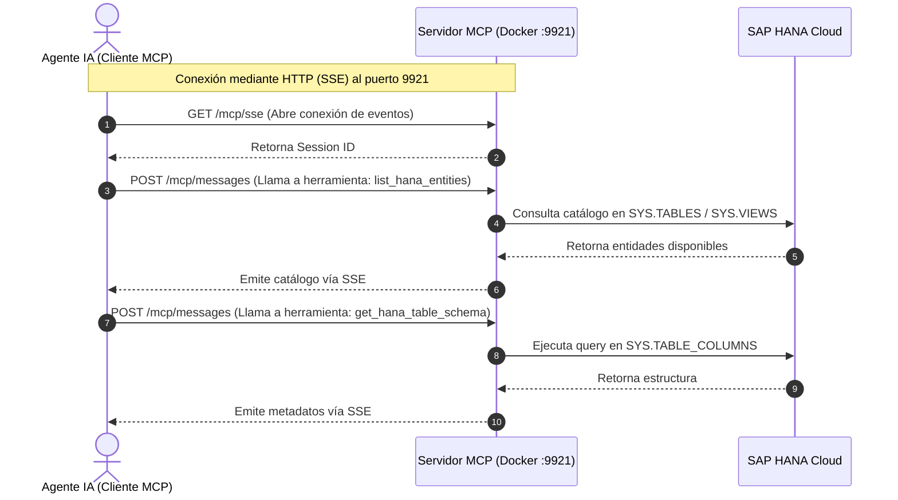

# Especificación de Arquitectura: Servidor MCP para Metadatos de SAP HANA Cloud

## 1. Resumen Ejecutivo
Esta solución propone la creación de un servidor basado en el **Model Context Protocol (MCP)**, diseñado para dotar a los modelos de Inteligencia Artificial (LLMs) de la capacidad de comprender, de forma dinámica y segura, el modelo de datos subyacente en una base de datos **SAP HANA Cloud**. 

El servidor expondrá herramientas que permiten a la IA **explorar (listar) el catálogo de objetos** y consultar a profundidad la estructura de las **tablas físicas, vistas (Views) y bibliotecas (SQLScript Libraries)**. Esto garantiza que la IA posea el contexto empresarial completo. La solución está diseñada para desplegarse ágilmente tanto en SAP BTP Cloud Foundry como en contenedores **Docker**.

## 2. Objetivos de la Solución
* **Proveer Contexto Estructural:** Permitir que una IA explore y consulte la estructura del catálogo en HANA en tiempo real.
* **Reducir Alucinaciones en IA:** Evitar que los agentes inteligentes asuman nombres de columnas o entidades incorrectas al otorgarles la habilidad de inspeccionar la base de datos primero.
* **Despliegue Flexible y Agnóstico:** Implementar la solución bajo estándares empresariales con **Node.js y NestJS**, empaquetada para su ejecución en **Docker** o SAP BTP Cloud Foundry.
* **Seguridad:** Mantener la conexión segura y centralizada delegando la inyección de credenciales al entorno en tiempo de ejecución.

## 3. Arquitectura Propuesta

La solución se compone de las siguientes tecnologías clave:

| Componente | Tecnología | Propósito |
| :--- | :--- | :--- |
| **Plataforma de Despliegue** | Docker / SAP BTP | Contenedorización para portabilidad extrema o PaaS para integración nativa SAP. |
| **Framework Backend** | Node.js + NestJS | Estructura modular, inyección de dependencias y exposición robusta de servicios web. |
| **Protocolo de IA** | `@modelcontextprotocol/sdk` | Implementación estándar de MCP para comunicar el servidor con agentes de IA. |
| **Transporte MCP** | HTTP / Server-Sent Events (SSE) | Comunicación bidireccional asíncrona sobre HTTP. El servicio se expondrá en el **puerto 9921**. |
| **Conector Base de Datos** | `@sap/hana-client` | Librería nativa para ejecutar sentencias SQL de alto rendimiento hacia HANA Cloud. |

### Diagrama de Secuencia y Flujo de Arquitectura



## 4. Especificación Técnica (Herramientas y Lógica)

### 4.1. Definición de Herramientas (Tools)
El servidor MCP registrará herramientas especializadas para descubrimiento y detalle:

1. **`list_hana_entities`**:
   * **Propósito:** Actúa como herramienta de "descubrimiento". Lista todas las tablas, vistas y librerías disponibles en un esquema determinado.
   * **Argumentos:** `schema_name`
2. **`get_hana_table_schema`**: 
   * Extrae la estructura de columnas y tipos de datos de una tabla específica.
   * Argumentos: `schema_name`, `table_name`.
3. **`get_hana_view_schema`**: 
   * Extrae las columnas y metadatos de las proyecciones de una Vista.
   * Argumentos: `schema_name`, `view_name`.
4. **`get_hana_library_info`**:
   * Descubre los miembros (funciones, procedimientos) alojados dentro de una SQLScript Library.
   * Argumentos: `schema_name`, `library_name`.

### 4.2. Lógica de Extracción de Metadatos
El servicio interactuará con las vistas del sistema utilizando los siguientes queries base:

**Para Descubrimiento (Listar entidades en un esquema):**
La IA consultará los catálogos principales para saber qué existe:
```sql
-- Tablas
SELECT TABLE_NAME FROM SYS.TABLES WHERE SCHEMA_NAME = ?;
-- Vistas
SELECT VIEW_NAME FROM SYS.VIEWS WHERE SCHEMA_NAME = ?;
-- Librerías
SELECT LIBRARY_NAME FROM SYS.LIBRARIES WHERE SCHEMA_NAME = ?;
```

**Para Detalles de Tablas y Vistas:**
```sql
SELECT POSITION, COLUMN_NAME, DATA_TYPE_NAME, LENGTH, SCALE, IS_NULLABLE, COMMENTS
FROM SYS.TABLE_COLUMNS -- (o SYS.VIEW_COLUMNS para Vistas)
WHERE SCHEMA_NAME = ? AND TABLE_NAME = ?
ORDER BY POSITION;
```

**Para Detalles de Librerías (SQLScript Libraries):**
```sql
SELECT MEMBER_NAME, MEMBER_TYPE, COMMENTS
FROM SYS.LIBRARY_MEMBERS 
WHERE SCHEMA_NAME = ? AND LIBRARY_NAME = ?;
```

## 5. Estrategia de Despliegue en Docker (Puerto 9921)
Para garantizar su rápida adopción y portabilidad a cualquier orquestador, el proyecto generará los artefactos necesarios de contenerización, exponiendo el tráfico web (SSE/POST) exclusivamente por el **puerto 9921**.

**Archivos que se generarán en la solución:**
1. **`Dockerfile`**: Compilará la aplicación NestJS, instalará dependencias (incluyendo los binarios de `@sap/hana-client`) y expondrá el contenedor (`EXPOSE 9921`).
2. **`docker-compose.yml`**: Orquestador local para levantar el servicio de manera expedita (`docker-compose up`). Configurado con mapeo de puertos `9921:9921`.
3. **`.dockerignore`**: Para evitar subir a la imagen las carpetas locales (`node_modules/`, `dist/`).

**Inyección de Credenciales en Docker:**
Las credenciales de acceso a HANA (Host, User, Password) se pasarán al contenedor de forma segura mediante un archivo `.env` o configuraciones de entorno de Docker Compose, el cual será interpretado por NestJS al iniciar el servicio, emulando el comportamiento seguro de los `VCAP_SERVICES` en Cloud Foundry.
