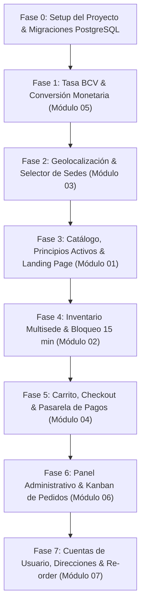

# Plan General de Implementación Paso a Paso — HospisaludWeb

**Versión:** 1.0  
**Fecha:** 2026-09-24  
**Metodología:** Spec-Driven Development (SDD) bajo estrategia Kiro  
**Referencias:**  
- [GEMINI.md](file:///h:/Repos/HospisaludWeb/GEMINI.md) (Reglas de Negocio)  
- [AGENTS.md](file:///h:/Repos/HospisaludWeb/AGENTS.md) (Estrategia y Directrices)  
- [docs/data-model.md](file:///h:/Repos/HospisaludWeb/docs/data-model.md) (Modelo de Datos PostgreSQL)  
- Carpeta `specs/` (Especificaciones de Módulos 01 al 07)

---

## 1. Orden de Dependencia de Módulos

Para evitar bloqueos durante la construcción, la implementación física debe ejecutarse estrictamente en el siguiente orden de capas:

---

## 2. Fases de Implementación Detalladas

### Fase 0: Bootstrap de Proyecto, Infraestructura Docker y Base de Datos
*Objetivo: Inicializar el repositorio físico con Next.js y orquestar el entorno local mediante Docker (Web en puerto 9241, PostgreSQL en puerto 9242).*

1. **Contenedores Docker para Desarrollo y Pruebas Locales:**
   - Crear archivo `Dockerfile` multi-stage para Next.js.
   - Crear archivo `docker-compose.yml` con los siguientes servicios y puertos fijos:
     - **Servicio `db` (PostgreSQL 16):**
       - Imagen: `postgres:16-alpine`
       - Puertos: `"9242:5432"` (puerto host **9242** hacia el 5432 interno)
       - Variables: `POSTGRES_USER=postgres`, `POSTGRES_PASSWORD=postgres`, `POSTGRES_DB=hospisalud`
       - Volumen persistente: `hospisalud_pgdata:/var/lib/postgresql/data`
     - **Servicio `web` (Next.js):**
       - Puertos: `"9241:3000"` (puerto host **9241** hacia el 3000 interno)
       - Variables: `DATABASE_URL=postgresql://postgres:postgres@db:5432/hospisalud`, `PORT=3000`
       - Dependencia: `depends_on: [db]`
2. **Inicialización de Next.js:**
   - Crear proyecto con `pnpm create next-app@latest . --typescript --tailwind --eslint --app --src-dir --import-alias "@/*"`.
3. **Dependencias Core:**
   - UI y Formularios: `lucide-react`, `zod`, `react-hook-form`, `@hookform/resolvers`, `clsx`, `tailwind-merge`.
   - Estado y Cache: `zustand`, `swr`, `cookies-next`.
   - Utilidades: `sharp` (compresión de imágenes), `date-fns` (fechas y tiempo de reserva).
   - Base de Datos: `drizzle-orm` + `postgres` (o `prisma` con cliente PostgreSQL).
4. **Migración Inicial de Base de Datos:**
   - Conectar a `localhost:9242` y ejecutar el script DDL documentado en `docs/data-model.md`.
   - Ejecutar Seed con las 4 sucursales fijas obligatorias:
     - Hospital (Lat: 8.88720, Lng: -64.24560)
     - Centro (Lat: 8.89500, Lng: -64.25000)
     - Petrucci (Lat: 8.87800, Lng: -64.26000)
     - Guanipa (Lat: 8.88200, Lng: -64.16500)
   - Registrar la primera tasa BCV base en `exchange_rates`.

---

### Fase 1: Capa Monetaria y Tasa Oficial BCV (`specs/05-tasa-bcv-configuracion/`)
*Objetivo: Tener disponible la conversión oficial USD -> VES antes de armar la UI de productos.*

1. Ejecutar las tareas de `specs/05-tasa-bcv-configuracion/tasks.md`:
   - [ ] Crear utilidades de formato `currency-service.ts` (`$0.00 USD` y `Bs. 0,00 VES`).
   - [ ] Implementar Server Actions para leer la tasa más reciente con cache tags de Next.js (`revalidateTag('bcv-rate')`).
   - [ ] Crear componente de cabecera `BcvRateBadge.tsx` que muestra la tasa visible en todo momento.
   - [ ] Crear vista administrativa `/admin/exchange-rate` para la actualización manual diaria del Super Admin.

---

### Fase 2: Geolocalización y Contexto de Sede (`specs/03-geolocalizacion-enrutamiento/`)
*Objetivo: Establecer la sede activa del usuario en el navegador y el servidor.*

1. Ejecutar las tareas de `specs/03-geolocalizacion-enrutamiento/tasks.md`:
   - [ ] Crear algoritmo Haversine en `src/domain/geo/haversine.ts`.
   - [ ] Configurar el store Zustand y la cookie `hospisalud_branch_id`.
   - [ ] Construir el modal inicial de GPS con fallback automático a la Sede Hospital.
   - [ ] Construir el dropdown de cambio manual de sede en la barra superior.
   - [ ] Implementar el motor de enrutamiento con la regla especial de Guanipa ($5 de envío).

---

### Fase 3: Catálogo, Buscador y Landing Page (`specs/01-catalogo-landing/`)
*Objetivo: Montar la vitrina pública y el pipeline de compresión de imágenes.*

1. Ejecutar las tareas de `specs/01-catalogo-landing/tasks.md`:
   - [ ] Implementar Server Actions para CRUD de principios activos (`components`).
   - [ ] Implementar pipeline de carga de imágenes con `sharp` (máx 1MB entrada, salida WebP <200kb).
   - [ ] Implementar Server Action de búsqueda con filtros combinados (Sede, Rango de precio, Principio activo).
   - [ ] Construir la tarjeta de producto con doble precio (USD/VES) y badges de flags.
   - [ ] Construir la página de inicio respetando estrictamente el orden:
     1. Hero con Buscador y Filtros.
     2. Carrusel de Ofertas (`is_oferta = TRUE`).
     3. Grilla de Destacados (`is_destacado = TRUE`).

---

### Fase 4: Inventario Multisede y Reservas Temporales (`specs/02-inventario-multisede/`)
*Objetivo: Garantizar stock real independiente y bloqueo temporal en el checkout.*

1. Ejecutar las tareas de `specs/02-inventario-multisede/tasks.md`:
   - [ ] Implementar cálculo de stock disponible (`stock_físico - reservas_activas`).
   - [ ] Construir componente de alerta: *"Agotado en esta sede. Disponible en [Sede X]"*.
   - [ ] Implementar `createStockReservation` con transacción `SELECT ... FOR UPDATE` para bloquear unidades por 15 minutos.
   - [ ] Crear endpoint de liberación periódica `/api/cron/release-reservations`.
   - [ ] Crear mantenedor de stock para el Administrador de Sede.

---

### Fase 5: Carrito, Checkout y Pasarela Manual de Pagos (`specs/04-carrito-checkout-pagos/`)
*Objetivo: Completar el ciclo de compra del cliente con las reglas médicas y logísticas.*

1. Ejecutar las tareas de `specs/04-carrito-checkout-pagos/tasks.md`:
   - [ ] Implementar store de carrito con validación reactiva de medicamentos de venta controlada o receta médica.
   - [ ] Construir vista de checkout:
     - Bloquear opción de Delivery si hay productos restringidos (forzar Pickup).
     - Aplicar tarifas de delivery ($2 Urbana, $5 Interurbana, $0 si subtotal >= $25).
   - [ ] Implementar pasarela de pago manual:
     - Pago Móvil (formulario de referencia).
     - Binance Pay (código QR y TxID).
     - Efectivo USD (campo de denominación de billete y cálculo de vuelto).
   - [ ] Registrar orden en estado `PENDIENTE_VERIFICACION`.

---

### Fase 6: Panel Administrativo y Tablero Kanban (`specs/06-admin-kanban-pedidos/`)
*Objetivo: Permitir al personal operar y despachar los pedidos en tiempo real.*

1. Ejecutar las tareas de `specs/06-admin-kanban-pedidos/tasks.md`:
   - [ ] Construir tablero Kanban filtrado por la sede asignada al operador.
   - [ ] Implementar polling de 10s con alerta sonora para nuevas órdenes entrantes.
   - [ ] Construir modal de verificación de pagos (validar referencia o efectivo) y confirmación de receta física.
   - [ ] Construir el buzón de órdenes `EN_ESPERA_GUANIPA` para aprobación manual de operadores de El Tigre.
   - [ ] Registrar cada transición de estado en `order_status_logs`.

---

### Fase 7: Cuentas de Usuario, Direcciones y Re-order (`specs/07-usuarios-cuentas/`)
*Objetivo: Fidelización de clientes y compras recurrentes sin fricción.*

1. Ejecutar las tareas de `specs/07-usuarios-cuentas/tasks.md`:
   - [ ] Configurar adaptador agnóstico de autenticación (`AuthAdapter`).
   - [ ] Implementar libreta de direcciones guardadas con zonas urbana/interurbana.
   - [ ] Construir vista de historial de compras con el botón "Repetir Pedido" para tratamientos continuos.

---

## 3. Matriz de Verificación y Checklist de Calidad (Definition of Done)

Antes de considerar listo el sistema para producción, se debe verificar el cumplimiento de los siguientes puntos:

- [ ] **Restricción Médica:** Al agregar un producto con `is_venta_controlada = TRUE`, el delivery se bloquea y solo permite Pickup.
- [ ] **Delivery Gratis:** Compras con subtotal de productos >= $25.00 USD cobran exactamente $0.00 de delivery.
- [ ] **Regla Guanipa:** Pedidos a Guanipa sin stock local entran en `EN_ESPERA_GUANIPA` y fijan $5.00 USD de delivery tras aprobación.
- [ ] **Compresión WebP:** Toda imagen subida se comprime a menos de 200kb en formato `.webp`.
- [ ] **Reserva de 15 Min:** Al abandonar el checkout, el stock se desbloquea tras cumplirse el tiempo límite.
- [ ] **Fallback GPS:** Al denegar la ubicación, la plataforma asigna Sede Hospital sin arrojar errores.
